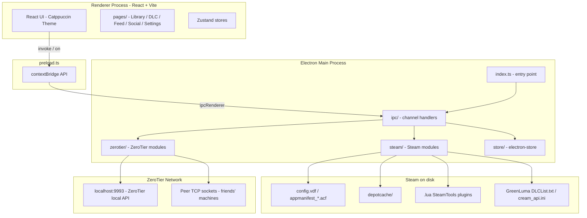
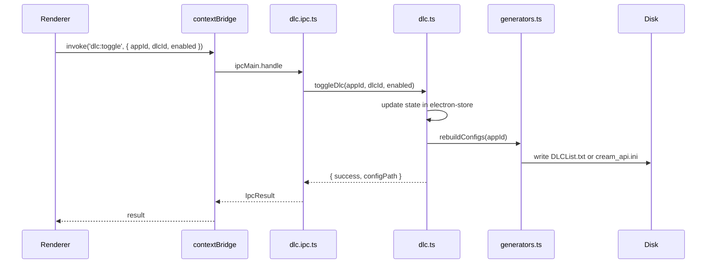
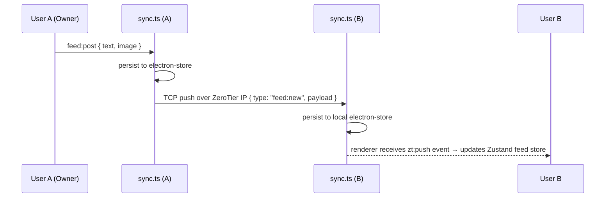

# Architecture — Octopus-R2

## Process Model

Octopus-R2 follows the standard Electron two-process model. All privileged operations (file system, registry, ZeroTier API, Steam config writes) run in the **main process**. The **renderer process** is a sandboxed React/Vite SPA that communicates with the main process exclusively through typed IPC channels exposed via `contextBridge`.



---

## Module Map

| File | Process | Responsibility |
|---|---|---|
| `src/main/index.ts` | Main | Create BrowserWindow, register IPC handlers, lifecycle |
| `src/main/preload.ts` | Main | `contextBridge` — expose typed API surface to renderer |
| `src/main/ipc/steam.ipc.ts` | Main | IPC handler wiring for all `steam:*` channels |
| `src/main/ipc/dlc.ipc.ts` | Main | IPC handler wiring for all `dlc:*` channels |
| `src/main/ipc/feed.ipc.ts` | Main | IPC handler wiring for all `feed:*` channels |
| `src/main/ipc/zt.ipc.ts` | Main | IPC handler wiring for all `zt:*` channels |
| `src/main/steam/scanner.ts` | Main | Detect Steam install path via registry; fallback path |
| `src/main/steam/vdf.ts` | Main | Parse and write Valve Data Format (`.vdf`, `.acf`) files |
| `src/main/steam/steamtools.ts` | Main | Read `.lua` plugin files → extract AppID + game name |
| `src/main/steam/dlc.ts` | Main | Resolve DLC list per AppID, manage toggle state |
| `src/main/steam/generators.ts` | Main | Write GreenLuma `DLCList.txt` and CreamAPI `cream_api.ini` |
| `src/main/zerotier/peer.ts` | Main | Query ZeroTier local API — network status, member list, self IP |
| `src/main/zerotier/sync.ts` | Main | TCP socket server/client — push/pull game and DLC data to peers |
| `src/main/store/index.ts` | Main | `electron-store` wrapper — settings, game list, DLC states, feed |
| `src/shared/types.ts` | Shared | TypeScript interfaces used by both main and renderer |
| `src/shared/ipc-channels.ts` | Shared | IPC channel name constants (single source of truth) |
| `src/renderer/main.tsx` | Renderer | React root, router setup |
| `src/renderer/pages/` | Renderer | Page components: Library, DLCManager, Feed, Social, Settings |
| `src/renderer/components/` | Renderer | Shared UI primitives: Card, Toggle, Badge, Feed post, etc. |
| `src/renderer/stores/` | Renderer | Zustand stores (one per domain) |

---

## IPC Channel Convention

All IPC channels follow the pattern `domain:action`.

```
steam:scan          →  Trigger Steam library scan
steam:games         →  Get current game list
dlc:list            →  Get DLC list for an AppID
dlc:toggle          →  Enable / disable a DLC
dlc:generate        →  Write config files for a game
feed:get            →  Get all feed posts
feed:post           →  Create a new post (owner only)
feed:react          →  Add reaction to a post
zt:status           →  Get ZeroTier network status
zt:peers            →  Get peer list with online status
zt:share            →  Toggle library sharing on/off
```

All handlers return a consistent envelope:

```typescript
type IpcResult<T> = { success: true; data: T } | { success: false; error: string }
```

---

## Data Flow: DLC Toggle



---

## Data Flow: ZeroTier Peer Sync



---

## Steam Path Resolution (Windows)

1. Read registry key: `HKCU\Software\Valve\Steam` → value `SteamPath`
2. Fallback: `C:\Program Files (x86)\Steam`
3. Key paths derived from Steam root:

| Purpose | Path |
|---|---|
| Main config | `<steam>/config/config.vdf` |
| App manifests | `<steam>/steamapps/appmanifest_<APPID>.acf` |
| Depot cache | `<steam>/steamapps/depotcache/` |
| SteamTools plugins | `<steam>/config/stplug-in/` |
| GreenLuma list | `<steam>/appcache/DLCList.txt` (varies) |
| CreamAPI config | `<steam>/steamapps/common/<GAME>/cream_api.ini` |

All path resolution is centralised in `src/main/steam/scanner.ts` via `getSteamPath()`. No other module hardcodes paths.

---

## ZeroTier Integration (No Port Forwarding)

- ZeroTier One runs as a local system service on each machine.
- The app reads the auth token from `%APPDATA%\ZeroTier\One\authtoken.secret`.
- All ZeroTier API calls go to `http://localhost:9993` with header `X-ZT1-Auth: <token>`.
- Peer discovery: `/network/<id>/member` endpoint returns all approved members with their ZeroTier IPs.
- Data sync: each Octopus-R2 instance runs a TCP server on a fixed port (default `49152`) bound to the ZeroTier interface IP.
- Peers connect to each other's ZeroTier IP:port to push/pull game library and feed data.

---

## Local Data Store

`electron-store` is used for all persistent local state. Schema:

```typescript
interface StoreSchema {
  settings: Settings
  games: GameEntry[]
  dlcStates: Record<string, Record<string, boolean>>  // appId -> dlcId -> enabled
  feed: FeedPost[]
  peers: PeerCache[]
}
```

Store lives at `%APPDATA%\octopus-r2\config.json` (Electron default userData path).
